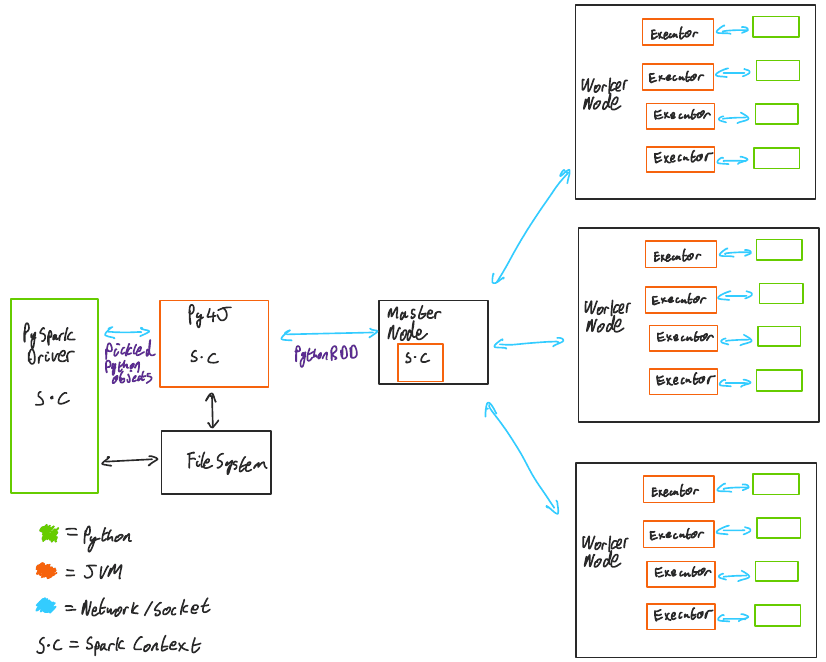

# Python Spark and JVM

- Spark is a JVM based framework. So the spark runs on the JVM.
- Pyspark - Python APIs for spark

Data processing is handled by the python process and the data persistence and transfer is handled by spark JVM processes.

Python driver process communicates with a local spark JVM process using **Py4J**.

## Py4J

> Py4J enables Python programs running in a Python interpreter to dynamically access Java objects in a Java Virtual Machine. Methods are called as if the Java objects resided in the Python interpreter and Java collections can be accessed through standard Python collection methods. Py4J also enables Java programs to call back Python objects. Py4J is distributed under the BSD license. - [Py4J](https://www.py4j.org/index.html)

- JVM program should be started before py4j program is started.

## Pyspark and Spark driver and SparkContext and py4j

- Pyspark program creates a `SparkContext` object either directly or indirectly via `SparkSession`
- A temporary file is created before `spark-submit` so that `py4j` server(that will be launched later) details can be dumped into it later. The path to this file is exported as environment variable `_PYSPARK_DRIVER_CONN_INFO_PATH` so that subprocesses can access this file.
- This sparkcontext executes `spark-submit`(as a subprocess) locally to spawn a local spark JVM process.
- Additionally `spark-submit` also instantiates a `PythonGatewayServer` to initialize a `py4j` server and the `py4j` server connection details(port number) are written to the temporary file that was created earlier.
- Now the pyspark driver process using the details from the temporary file can connect to this `PythonGatewayServer` that is based on `py4j` and hence can communicate with the local spark JVM process(spark driver process) that was launched using `spark-submit`.

## Spark workers and PythonRDD objects

- Functions passed to RDD operations like `map`, `flatMap` etc will be serialized using `cloudpickle`
- These are then sent to the worker nodes by the `PythonRDD` objects inside the local spark JVM.
- These serialized objects are deserialized and then executed in a python process that are spawned on the worker nodes.
- The results(incase we do operations like `collect`that send the values back to the driver) are then sent back to `PythonRDD` object via TCP socket.

---

## References

- [Python, Spark and the JVM: An overview of the PySpark Runtime Architecture](https://dev.to/steadbytes/python-spark-and-the-jvm-an-overview-of-the-pyspark-runtime-architecture-21gg)
- [Py4J working](https://www.waitingforcode.com/pyspark/pyspark-jvm-introduction-1/read)
